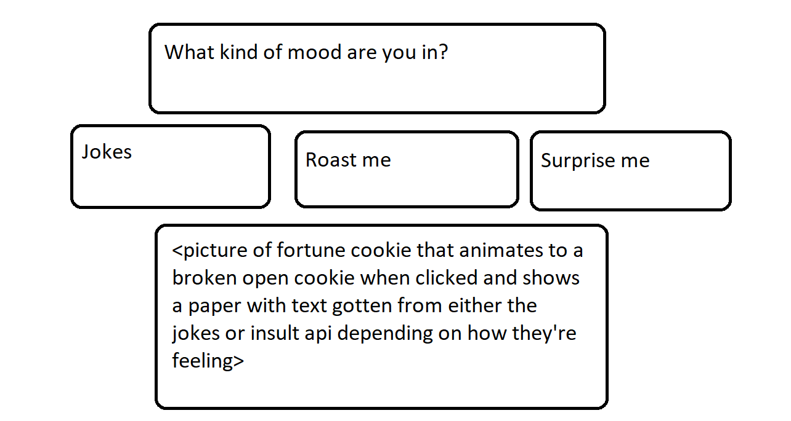

# Project Title

# Project Description

On our application we will have a series of buttons: "Joke", "Roast me", or "surprise me" ( containing a Giphy )
When the user clicks on one of the buttons, it will generate/request from API url to give us one of the following

Joke- pulling a generated joke
Roast me- pulling a generated insult (class appropriate)
Surprise me- giphy of our choice

# User Story
AS A --person-- with an incredibly busy schedule, I WANT  --to request a bit of light humor--, SO THAT I --can take a break from my work--.

# Wire Frame

# APIs to be used
https://sv443.net/jokeapi/v2/

